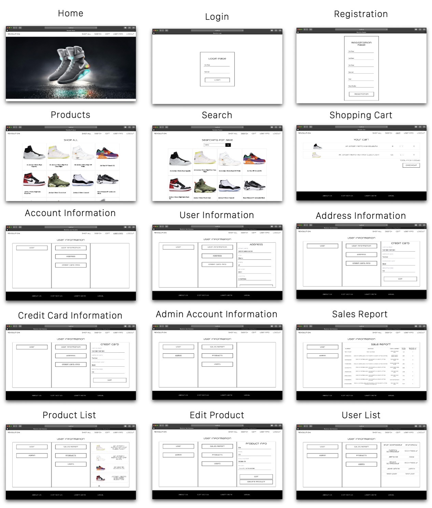

# Revolution PHP Application

A web-based applicaiton in order to create an E-Commerce website. The application that is created is call Revolution and is made in order to provide a user with a store to buy exlcusive shoes. The main idea of Revolution is build from a simillar web applicaiton called GOAT. The website is created with a full checkout process in which allows the user to be able to save multiple addresses and credit cards to their own account. The user will also be able to see all past orders.

<h2>Freatures</h2>
    User Features: 
1. Login
1. Registration
1. View Product List
1. Search prdoucts By paramenter
1. View specifc product
1. Add Items to Card
1. Checkout
1. Save Address Information
1. Save Credit Card Information 
    Admin Features: 
1. View All Users
1. View All Products
1. Edit a Product
1. Add a Product
1. Remove a Product
1. View All Orders

<h2>Technologies Used:</h2>
Language: PHP 7.3.11 
IDE: Eclipse IDE for PHP Developers (4.9.0) 
Server: MAMP 5.2 
Database: MySQL 7.2.23 

<h2>Documentation:</h2>

Attached below are all the UML and Diagrams used throught the creation of the project as well screen shots of the final product running. 

<h4>UML Diagram</h4>

	

<h4>Site Map Diagram</h4>

	

<h4>ER Diagram</h4>

	

<h4>Final Product</h4>

	

